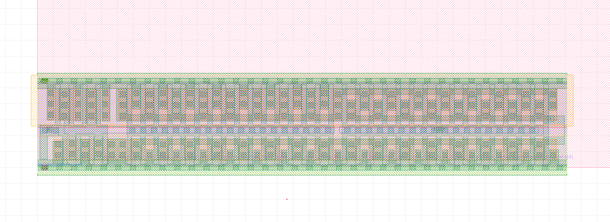

# Voyager FDS on a Chip

The computer that left the solar system. On SKY130 silicon.



*The Voyager Flight Data Subsystem, placed on SkyWater SKY130 130nm silicon. Each coloured rectangle is a transistor. The green is polysilicon. The pink is metal1. The blue is nwell. The original filled a shoebox. This fits on a grain of sand.*

## What Is This

A synthesisable implementation of the Voyager Flight Data Subsystem (FDS) processor, the computer that flew on Voyager 1 and Voyager 2. Synthesised to SkyWater SKY130 130nm standard cells.

| | |
|---|---|
| **Gates** | 58 (after optimisation) |
| **Area** | 4,793 µm² |
| **Timing** | Met at 1 MHz (original: 806.4 kHz) |
| **Architecture** | 16-bit words, 13-bit PC, ALU with ADD/SUB/XOR/AND/OR |
| **Source** | JPL Memo MJS 2.64A (Wooddell, 7 October 1974) |
| **Status** | Still operating. 24 billion km away. |

## Files

- `voyager_fds.sv` — SystemVerilog source (the design)
- `voyager_fds_sky130.v` — SKY130 gate-level netlist
- `voyager_fds.def` — Placed layout (viewable in KLayout)
- `sky130_fd_sc_hd.gds` — SKY130 cell library GDS (for viewing)
- `flow/` — OpenROAD scripts for place-and-route

## Viewing the Layout

1. Install [KLayout](https://www.klayout.de/)
2. Open `sky130_fd_sc_hd.gds` (cell library)
3. Open `voyager_fds.def` (placed design)
4. Zoom in. Those are the transistors of the computer that photographed Neptune.

## Building

```bash
# Synthesise
takahe --lib sky130_fd_sc_hd__tt_025C_1v80.lib \
       --map voyager_fds_sky130.v \
       --sta 1 \
       voyager_fds.sv

# Place and route (Docker)
docker run -v $(pwd):/work openroad/orfs \
       bash /work/flow/clean_and_route.sh
```

## Fabricate

Submit the layout to [TinyTapeout](https://tinytapeout.com) for a SKY130 shuttle run. ~$150 for a tile. 12-16 weeks to silicon. The computer that went to Neptune, in your hand.

## History

The FDS was designed by JPL engineers in the early 1970s. The architecture memo is dated October 7, 1974. Voyager 1 launched September 5, 1977. Voyager 2 launched August 20, 1977.

Both spacecraft are still operating. Voyager 1 has entered interstellar space. The FDS processes all science data: every photograph of Jupiter, every reading from Saturn's rings, every measurement of the heliopause.

It has been running for 48 years without a reboot. Your phone struggles to make it through the day.

We thought someone should be able to hold that computer in their hand.

## License

MIT. The instruction set is from a 1974 JPL memo (US government, public domain). The implementation is original.
